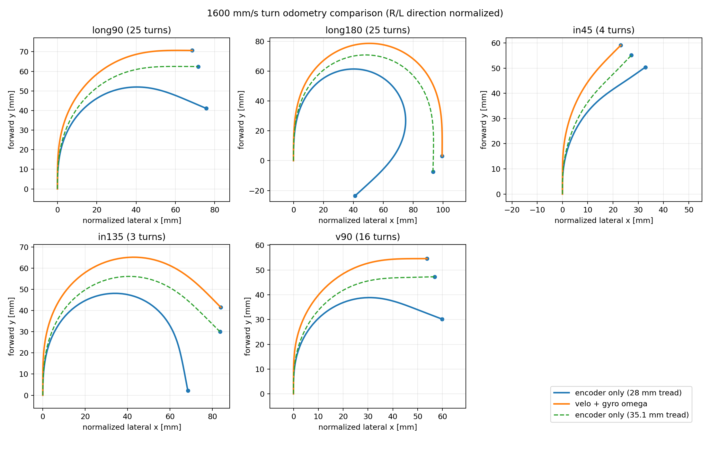

# 1600 mm/s turn odometry comparison

- turns: 73
- nominal tread: 28.0 mm
- encoder/gyro observed effective tread: 35.118 mm
- encoder distance / velo distance: 0.9618
- mean wheel-minus-velo/omega angle: +30.652 deg
- mean endpoint separation: 40.332 mm

- mean endpoint separation with observed tread: 9.733 mm

| motion | n | wheel angle [deg] | velo/omega angle [deg] | angle diff [deg] | endpoint diff [mm] | distance ratio | effective tread [mm] |
| --- | ---: | ---: | ---: | ---: | ---: | ---: | ---: |
| long_r90 | 12 | 113.913 | 90.546 | +23.367 | 30.569 | 0.9612 | 35.226 |
| long_l90 | 13 | 113.226 | 90.536 | +22.689 | 30.224 | 0.9681 | 35.017 |
| long_r180 | 15 | 227.396 | 180.704 | +46.692 | 63.570 | 0.9614 | 35.235 |
| long_l180 | 10 | 228.313 | 180.510 | +47.803 | 64.879 | 0.9610 | 35.415 |
| in_r45 | 2 | 55.576 | 44.254 | +11.323 | 13.797 | 0.9643 | 35.164 |
| in_l45 | 2 | 54.173 | 45.120 | +9.053 | 12.338 | 0.9707 | 33.620 |
| in_r135 | 1 | 170.659 | 135.737 | +34.922 | 42.582 | 0.9431 | 35.204 |
| in_l135 | 2 | 168.975 | 135.702 | +33.273 | 42.162 | 0.9456 | 34.865 |
| r_v90 | 8 | 111.714 | 89.711 | +22.003 | 25.434 | 0.9567 | 34.868 |
| l_v90 | 8 | 110.662 | 89.965 | +20.696 | 24.941 | 0.9630 | 34.442 |

