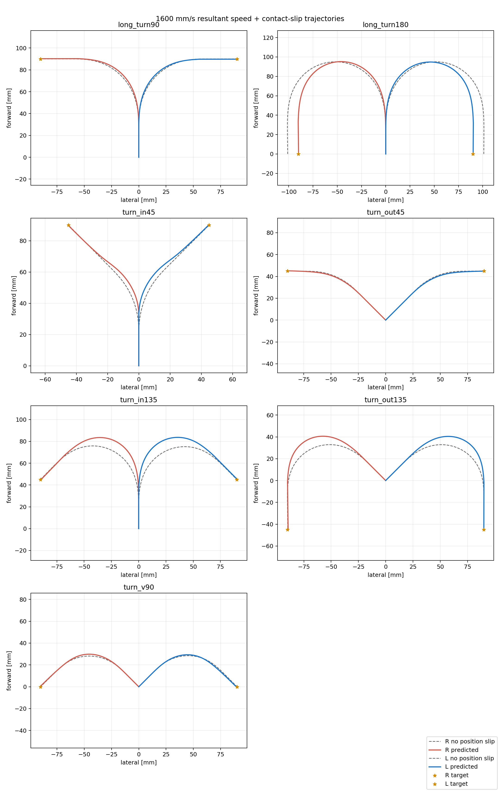
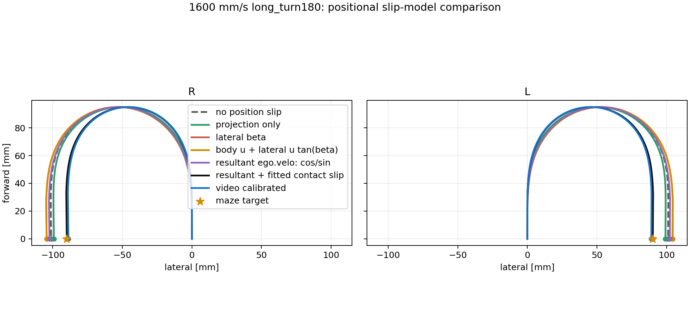

# 1600 mm/s variable-speed slip length model

- right slip k: 239.34375
- left slip k: 260.464286
- resultant-speed model: logged `ego.velo` is the ground-speed magnitude
- body-forward component: `v_forward = ego.velo cos(beta)`
- perpendicular lateral component: `v_lateral = ego.velo sin(beta)`
- contact translation scale: `1 - 3.125328 beta^2`
- the same contact scale is applied to both components so that the slip angle remains beta
- a firmware-forced terminal beta zero is replaced by one continuous beta-dynamics step
- during Lend, beta decays continuously with `beta_dot = -k beta / ego.velo - omega`
- the resultant ground-velocity direction is displaced from body heading by beta
- measured `ego.velo`, `ego.rad_velo`, and logged beta profiles are replayed
- velocity input: direction/motion-specific mean `ego.velo` profile

| motion | side | r_min [mm] | mean ego.velo [m/s] | forward loss mean [%] | forward loss peak [%] | Lstart [mm] | Lend [mm] | predicted end (lat, fwd) [mm] | target end (lat, fwd) [mm] | target error [mm] |
| --- | :---: | ---: | ---: | ---: | ---: | ---: | ---: | ---: | ---: | ---: |
| long_turn90 | R | 52.00 | 1.6044 | 7.914 | 13.714 | 15.949 | 34.557 | (-90.00, 90.21) | (-90.00, 90.00) | 0.21 |
| long_turn90 | L | 52.00 | 1.5935 | 7.732 | 13.294 | 15.949 | 34.557 | (90.00, 89.79) | (90.00, 90.00) | 0.21 |
| long_turn180 | R | 48.00 | 1.5899 | 9.666 | 16.040 | 11.835 | 32.461 | (-89.87, 0.33) | (-90.00, 0.00) | 0.35 |
| long_turn180 | L | 48.00 | 1.5871 | 9.532 | 15.678 | 11.835 | 32.461 | (90.13, -0.32) | (90.00, 0.00) | 0.35 |
| turn_in45 | R | 55.00 | 1.6137 | 5.868 | 11.235 | 23.467 | 25.216 | (-44.41, 89.10) | (-45.00, 90.00) | 1.08 |
| turn_in45 | L | 55.00 | 1.6446 | 6.115 | 11.666 | 23.467 | 25.216 | (44.61, 89.94) | (45.00, 90.00) | 0.40 |
| turn_out45 | R | 60.00 | 1.5732 | 4.937 | 9.673 | 22.042 | 20.468 | (-88.56, 45.10) | (-90.00, 45.00) | 1.44 |
| turn_out45 | L | 60.00 | 1.5704 | 4.952 | 9.344 | 22.042 | 20.468 | (88.52, 44.81) | (90.00, 45.00) | 1.49 |
| turn_in135 | R | 42.00 | 1.5589 | 11.429 | 19.929 | 18.160 | 30.547 | (-89.78, 44.67) | (-90.00, 45.00) | 0.40 |
| turn_in135 | L | 42.00 | 1.5583 | 11.258 | 19.343 | 18.160 | 30.547 | (90.22, 45.33) | (90.00, 45.00) | 0.40 |
| turn_out135 | R | 39.30 | 1.5578 | 12.364 | 21.618 | 17.976 | 43.641 | (-89.41, -44.88) | (-90.00, -45.00) | 0.61 |
| turn_out135 | L | 39.30 | 1.5511 | 12.064 | 20.909 | 17.976 | 43.641 | (89.96, -45.11) | (90.00, -45.00) | 0.12 |
| turn_v90 | R | 40.00 | 1.5886 | 12.506 | 22.949 | 7.367 | 25.221 | (-89.65, 0.89) | (-90.00, 0.00) | 0.96 |
| turn_v90 | L | 40.00 | 1.5787 | 12.234 | 21.867 | 7.367 | 25.221 | (89.38, -0.11) | (90.00, 0.00) | 0.63 |

## Trajectories

- [long_turn90](trajectories/long_turn90.png)
- [long_turn180](trajectories/long_turn180.png)
- [turn_in45](trajectories/turn_in45.png)
- [turn_out45](trajectories/turn_out45.png)
- [turn_in135](trajectories/turn_in135.png)
- [turn_out135](trajectories/turn_out135.png)
- [turn_v90](trajectories/turn_v90.png)

## Velocity components

- [long_turn90](velocity_profiles/long_turn90.png)
- [long_turn180](velocity_profiles/long_turn180.png)
- [turn_in45](velocity_profiles/turn_in45.png)
- [turn_out45](velocity_profiles/turn_out45.png)
- [turn_in135](velocity_profiles/turn_in135.png)
- [turn_out135](velocity_profiles/turn_out135.png)
- [turn_v90](velocity_profiles/turn_v90.png)

## Long-180 model comparison

